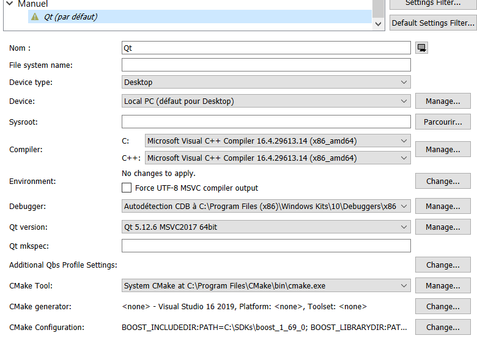

# Installation du projet DummyEditor pour Windows

## Prérequis

- Avoir un compte github, lié avec une paire de clés SSH
- Outils:
  - Git pour Windows: https://git-scm.com/download/win (activer git bash) ou GitExtension
  - compilateur **MSVC** et Windows SDK : inclus avec **Visual Studio 2019** avec le packet **Desktop C++**.
    - Attention: MinGW peut ne pas fonctionner sur ce projet à cause de cette issue: https://sourceforge.net/p/mingw-w64/bugs/737/
  - **CMake v3.13** minimum
  - **QtCreator** (recommandé) *(Visual Studio ou un éditeur de texte + CMake-gui sont des alternatives valides si les librairies Qt sont installées)*
- Libraries nécessaires:
  - Lua 5.3 https://sourceforge.net/projects/luabinaries/files/5.3.5/Windows%20Libraries/Static/lua-5.3.5_Win64_vc14_lib.zip/download
  - Boost 1_69 pour MSVC https://github.com/dummymeuporg/dummymeuporg.github.io/wiki/Install-boost-on-Windows

## Configurer projet

- Ouvrir git bash et cloner le projet
```
    git clone https://github.com/dummymeuporg/dummyeditor.git
```
- Ouvrir le dossier cloné
```
    cd dummueditor
```
- Et initialiser les sous-modules
```
    git submodule init
    git submodule update
```

- Configurer QtCreator: Tools -> options -> Kits, trouverou créer un Kit pour complier avec MSVC. Le kit sélectionné ne dois pas avoir un icône rouge. Si c'est le cas, survoler l'icône pour connaître le problème.


- Configurer CMake:
    - CMake a besoin de connaître certaines variables pour fonctionner, dont où se trouvent Boost et Lua. Si vous utilisez QtCreator, le meilleur moyen est d'y régler la configuration cmake :
    - Tools -> Options -> Kits -> (choose the right one):
      - **CMake generator**: mettre "Visual studio 16 2019 / none"
    - configuration CMake : ajouter les variables suivantes : (et adapter les valeurs en fonction)
      - BOOST_INCLUDEDIR:PATH=C:\SDKs\boost_1_69_0
      - BOOST_LIBRARYDIR:PATH=C:\SDKs\boost_1_69_0\lib64-msvc-14.1
      - BOOST_ROOT:PATH=C:\SDKs\boost_1_59_0\boost
      - LUA_INCLUDE_DIR:PATH=C:\SDKs\lua-5.3.5_Win64_vc14_lib\include
      - LUA_LIBRARIES:FILEPATH=C:\SDKs\lua-5.3.5_Win64_vc14_lib\lua53.lib
      - LUA_LIBRARY:FILEPATH=C:\SDKs\lua-5.3.5_Win64_vc14_lib\lua53.lib
    - Si vous n'utilisez pas QtCreator il fautdra renseigner une variable suplémentaire :  CMAKE_PREFIX_PATH:STRING=path/to/Qt/folder

- Charger le projet :
   - QtCreator -> Open project -> Select dummyeditor/CMakeList.txt
   - Ne sélectionner QUE le kit précédemment créé
   - "Configure project" et attendre. Vous devriez alors voir l'architecture fichiers du projet.
   - Configurer la "build target" : Projects (colonne de gauche) -> Build Steps -> details -> cocher **seulement** dummyeditor.

- Et c'est bon ! Compiler et lancer !

## Divers
### Comment lier une clé SSH à son compte github
Reglages du compte -> clés SSH et GPG.
Suivre le lien "guide to generating SSH keys" pour avoir la procédure détaillée.

### Ma clé SSH générée n'est pas acceptée par github
La clé générée de la façon renseignée dans la documentation de github doit commencer par "ssh-rsa".
Si ce n'est pas le cas, la clé peut être refusée par github et cela peut être dû à une mauvaise version de "ssh-keygen" installé.
Utilisez alors la génération de clés SSH de Putty, suivez les instructions de ce lien : https://stackoverflow.com/questions/31813080/windows-10-ssh-keys

### Git submodule update dit que je "don't have the permissions to clone"...
Vérifier que la configuration de votre compte github et ses clés SSH est bien réalisée.
